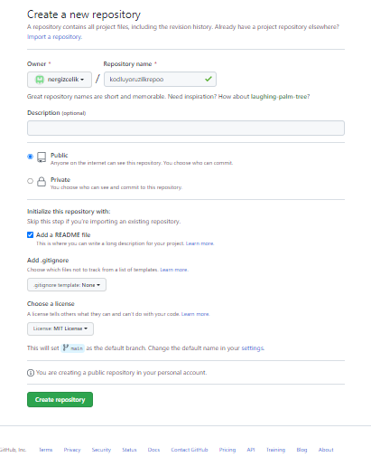

# Kodluyoruz İlk Repo
- [Kodluyoruz](https://kodluyoruz.org/tr/kodluyoruz/) Eğitimi kapsamında açtığım ilk repo içerisinde proje dosyaları bunmaktadır.

## Image
- 

## Installation
- Öncelikle projeyi clonlayın. (Buraya sizin reponuzdan aldığınız yer gelecek)
- [GİTHUP link](https://github.com/nergizcelik/kodluyoruzilkrepo)

## Usage
- Projeyi clonladıktan sonra Visual Studio Code programını çalıştırınız.

Linux için
 `  `  ` 
cd kodluyoruzilkrepo
code .
 `  `  ` 

## Contributing 
- Pull requestler kabul edilir.Büyük değişiklikler için,lütfen önce neyi değştimek istediğinize tartışmak için bir konu açın.

## Licanse
- [MIT](https://choosealicense.com/licenses/mit/)

